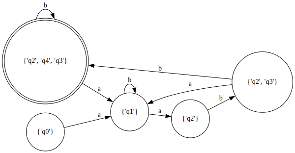
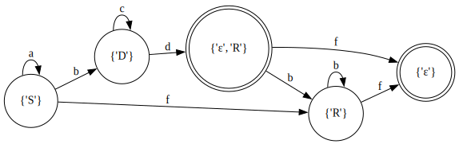

- [Implementation of formal languages](#org56c7832)
- [Objectives](#orgc89bcfc)
  - [Lab 1](#orgc9492ce)
  - [Lab 2](#orgaa94c5b)
    - [Convert NFA to Grammar](#org527350e)
    - [Find out if FA is nondeterministic](#org3baaa4a)
    - [Convert NFA to DFA](#org846893a)
    - [Visualize the finite automata](#orgd4b56e0)
    - [Convert Grammar to NFA to DFA (lab 1)](#orga90cb79)
- [Implementation](#org990f2f7)
- [Try it out](#org46edfd5)
- [Theory](#org499c630)


<a id="org56c7832"></a>

# Implementation of formal languages

Course
: Formal Languages &amp; Finite Automata

Author
: Balan Artiom


<a id="orgc89bcfc"></a>

# Objectives


<a id="orgc9492ce"></a>

## Lab 1

-   [X] Implement a  `Grammar` and a `FiniteAutomaton`, with the respective methods:
    -   `Grammar`
        -   `generateString()`
        -   `convert_to_FSM()`
    -   `FiniteAutomaton`
        -   `check_string()`
-   [X] Showcase the code:
    -   generate 5 words with the grammar
    -   create a FSM from the grammar
    -   check that the generated words are valid according to the FSM


<a id="orgaa94c5b"></a>

## Lab 2

-   [X] Provide a function in your grammar type/class that could classify the grammar based on Chomsky hierarchy.
-   [X] Implement conversion of a finite automaton to a regular grammar.
-   [X] Determine whether your FA is deterministic or non-deterministic.
-   [X] Implement some functionality that would convert an NDFA to a DFA.
-   [X] Represent the finite automaton graphically (Optional, and can be considered as a bonus point):
-   [X] Document everything in the README
-   [X] Test string validation with the new more general DFA

Here&rsquo;s the NFA I got:

```text
Q = {q0,q1,q2,q3,q4},
∑ = {a,b},
F = {q4},
δ(q0,a) = q1,
δ(q1,b) = q1,
δ(q1,a) = q2,
δ(q2,b) = q2,
δ(q2,b) = q3,
δ(q3,b) = q4,
δ(q3,a) = q1.
```

After manually rewriting it like this:

```python
S = {"q0","q1","q2","q3","q4"}
A = {"a","b"}
s0 = "q0"
F = {"q4"}
d = {("q0","a"): {"q1"},
     ("q1","b"): {"q1"},
     ("q1","a"): {"q2"},
     ("q2","b"): {"q2", "q3"},
     ("q3","b"): {"q4"},
     ("q3","a"): {"q1"}}
```

I can initialize an NFA, and then do many things with it.

```python
nfa = NFA(S=S, A=A, s0=s0, d=d, F=F)
```


<a id="org527350e"></a>

### Convert NFA to Grammar

I can find out the type of the resulting grammar in the Chomsky hierarchy:

```python
g = nfa.to_grammar()
print(g.type())
```

```text
3
```

Or print out the grammar if I format it a bit:

```python
for l,r in g.P.items():
    print(''.join(l), '->', ' | '.join([' '.join(t) for t in r]))
```

```text
q0 -> a q1
q1 -> b q1 | a q2
q2 -> b q2 | b q3
q3 -> b q4 | a q1
q4 ->
```


<a id="org3baaa4a"></a>

### Find out if FA is nondeterministic

Even though it&rsquo;s an NFA, it could be that it doesn&rsquo;t have nondeterministic transitions.
We can find that out:

```python
print(nfa.is_deterministic())
```

```text
False
```


<a id="org846893a"></a>

### Convert NFA to DFA

```python
dfa = nfa.to_DFA()
print(dfa)
```

```text
{frozenset({'q4', 'q2', 'q3'}), frozenset({'q2'}), frozenset({'q1'}), frozenset({'q0'}), frozenset({'q2', 'q3'})}, {'a', 'b'}, {'q0'}, {(frozenset({'q0'}), 'a'): {'q1'}, (frozenset({'q1'}), 'a'): {'q2'}, (frozenset({'q1'}), 'b'): {'q1'}, (frozenset({'q2'}), 'b'): {'q2', 'q3'}, (frozenset({'q2', 'q3'}), 'a'): {'q1'}, (frozenset({'q2', 'q3'}), 'b'): {'q4', 'q2', 'q3'}, (frozenset({'q4', 'q2', 'q3'}), 'a'): {'q1'}, (frozenset({'q4', 'q2', 'q3'}), 'b'): {'q4', 'q2', 'q3'}}, {frozenset({'q4', 'q2', 'q3'})}
```

Now that we have a DFA, we can easily validate some strings according to the grammar.
But first, let&rsquo;s generate a few:

```python
l = [g.constr_word() for _ in range(5)]
print(l)
```

```text
['aabbb', 'ababbababbbababb', 'abbbabbb', 'ababbb', 'aabbbb']
```

Let&rsquo;s verify that they&rsquo;re all valid:

```python
print(all(dfa.verify(w) for w in l))
```

```text
True
```


<a id="orgd4b56e0"></a>

### Visualize the finite automata

Here&rsquo;s the NFA:

```python
fn = nfa.draw('./img', 'variant_3_nfa')
print(fn)
```


And the DFA:

```python
fn = dfa.draw('./img', 'variant_3_dfa')
print(fn)
```




<a id="orga90cb79"></a>

### Convert Grammar to NFA to DFA (lab 1)

Extending on the previous lab task,
I can now do some things with the grammar I got:

```text
VN={S, D, R},
VT={a, b, c, d, f},
P={
    S → aS
    S → bD
    S → fR
    D → cD
    D → dR
    R → bR
    R → f
    D → d
}
```

After converting it manually to a Grammar data structure, of course:

```python
VN = {"S", "D", "R"}
VT = {"a", "b", "c", "d", "f"}
S = "S"
P = {("S",): {("a", "S"), ("b", "D"), ("f", "R")},
     ("D",): {("c", "D"), ("d", "R"), ("d")},
     ("R",): {("b", "R"), ("f")}}
g = Grammar(VN=VN, VT=VT, P=P, S=S)
```

Note that the keys in the `P` dict are tuples. Remember kids, `(A)` is not a tuple, but `(A,)` is.

Now, let&rsquo;s convert the grammar to an NFA:

```python
nfa = NFA.from_grammar(g)
print(nfa.draw('img', 'lab1_v3_nfa'))
```


Hmm, looks like it&rsquo;s not deterministic because of those two &ldquo;d&rdquo; transitions from the &ldquo;D&rdquo; state. Let&rsquo;s check:

```python
print(nfa.is_deterministic())
```

```text
False
```

Yeah, it isn&rsquo;t. OK, no problem. We can just convert it to a DFA:

```python
dfa = nfa.to_DFA()
print(dfa.draw('img', 'lab1_v3_dfa'))
```



Looks better!


<a id="org990f2f7"></a>

# Implementation

I wrote very extensive comments inside source code files, so refer to those please.


<a id="org46edfd5"></a>

# Try it out

You can starts playing inside `main.py`.

There are a few tests that you can run with `pytest`,
but they&rsquo;re not very extensive.
Also pls don&rsquo;t look inside, I&rsquo;ll refactor them I promise.


<a id="org499c630"></a>

# Theory

An instance of a **formal language** is a set of _words_ which are composed of _letters_.
The set of words can be defined in many ways:

-   by simply enumerating all the valid elements (words)
-   by defining an alphabet and a grammar

An **alphabet** is a set of letters.

A **grammar** is a set of rules that define how to form valid words from the alphabet.

A regular grammar is one in which all production rules in P are of one of the following forms:

-   A → a
-   A → aB
-   A → ε

where A, B, S ∈ N are non-terminal symbols, a ∈ Σ is a terminal symbol,
and ε denotes the empty string, i.e. the string of length 0. S is called the start symbol.

[Automata](https://en.wikipedia.org/wiki/Automata_theory) can be used to recognize formal languages, for example described by grammars.
There are different [types of automata](https://en.wikipedia.org/wiki/Automata_theory#Types_of_automata) that can describe different types of languages.
For example:

-   A finite automaton (NFA/DFA, state machine) can describe a regular grammar (type 3)
-   A pushdown automaton (PDA) can describe a context-free grammar (type 2)

A DFA is equivalent in power to an NFA, even though NFA&rsquo;s are more flexible ([Hierarchy in terms of powers](https://en.wikipedia.org/wiki/Automata_theory#Hierarchy_in_terms_of_powers)).

-   The conversion NFA -&gt; DFA can be done using the [powerset construction](https://en.wikipedia.org/wiki/Powerset_construction).
-   The conversion regular grammar -&gt; NFA and viceversa is straightforward.
-   The conversion Grammar -&gt; DFA can&rsquo;t really be done directly,
    instead go through the steps: Grammar -&gt; NFA -&gt; DFA.

